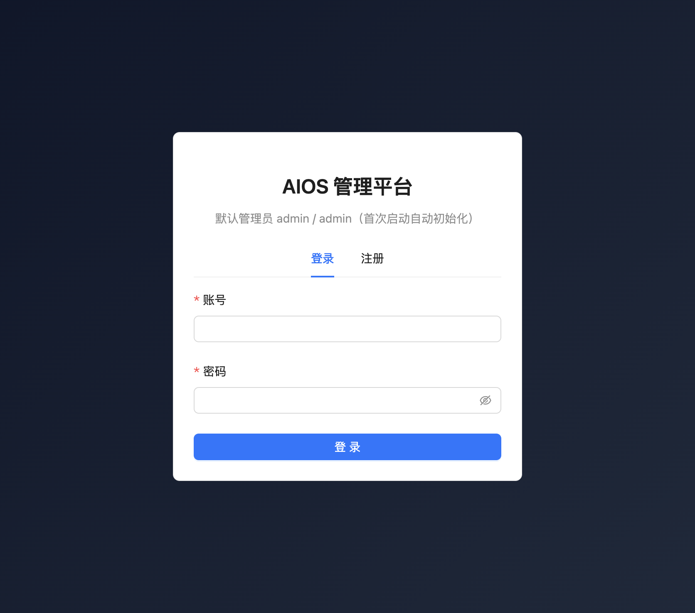
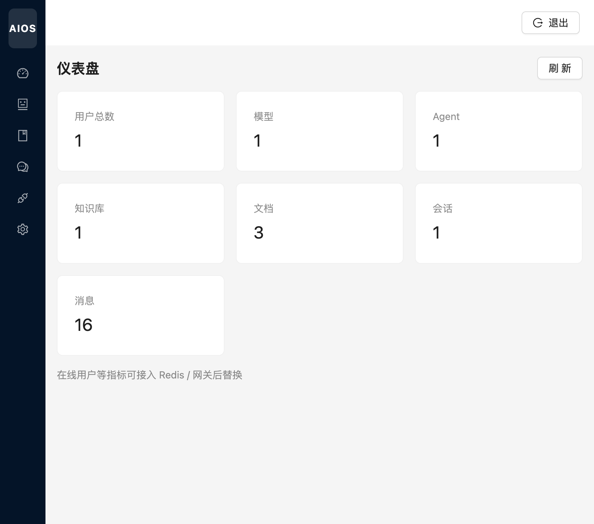

# 登录与工作台

[← 返回 Wiki 首页](Home.md)

---

## 登录页

访问 `http://127.0.0.1:5173/login`。首次部署后使用默认管理员 **admin / admin**（数据库 `DataInitializer` 自动创建）。

| 区域 | 说明 |
|------|------|
| 登录 / 注册 | 切换账号登录或自助注册 |
| 账号 / 密码 | 必填；密码框支持显示/隐藏 |
| 登 录 | 成功后写入 JWT，跳转工作台 |

---

## 工作台（仪表盘）

路由：`/dashboard`。展示平台资源汇总，便于运维巡检。

| 指标卡 | 含义 |
|--------|------|
| 用户总数 | 已注册用户数 |
| 模型 / Agent | AI 中心配置数量 |
| 知识库 / 文档 | 知识库与已录入文档数 |
| 会话 / 消息 | 聊天中心会话与消息总量 |

点击右上角 **刷新** 重新拉取统计；**退出** 清除本地 Token 并返回登录页。

---

## 侧栏导航

登录后左侧为折叠图标菜单，悬停可展开文字。模块与 [Home.md](Home.md) 路由表一致；无权限的菜单项不会显示。
