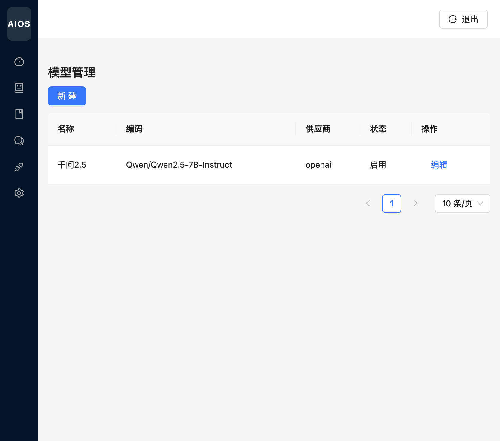
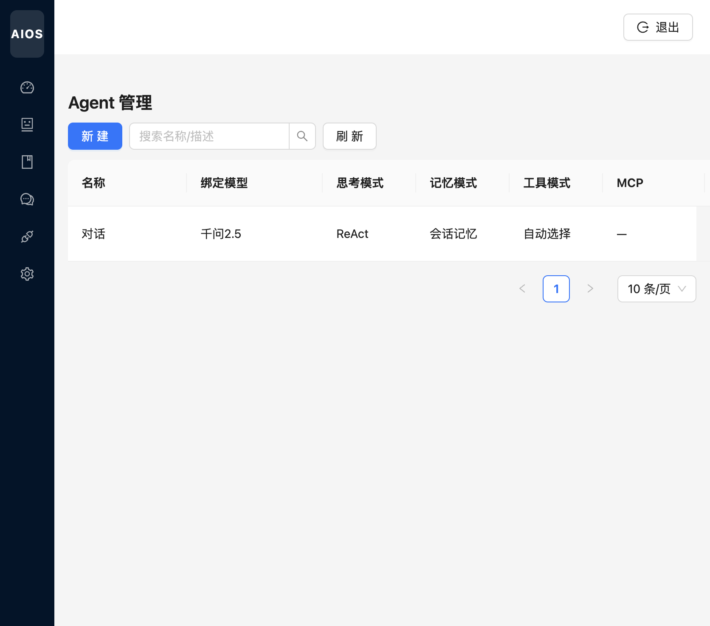
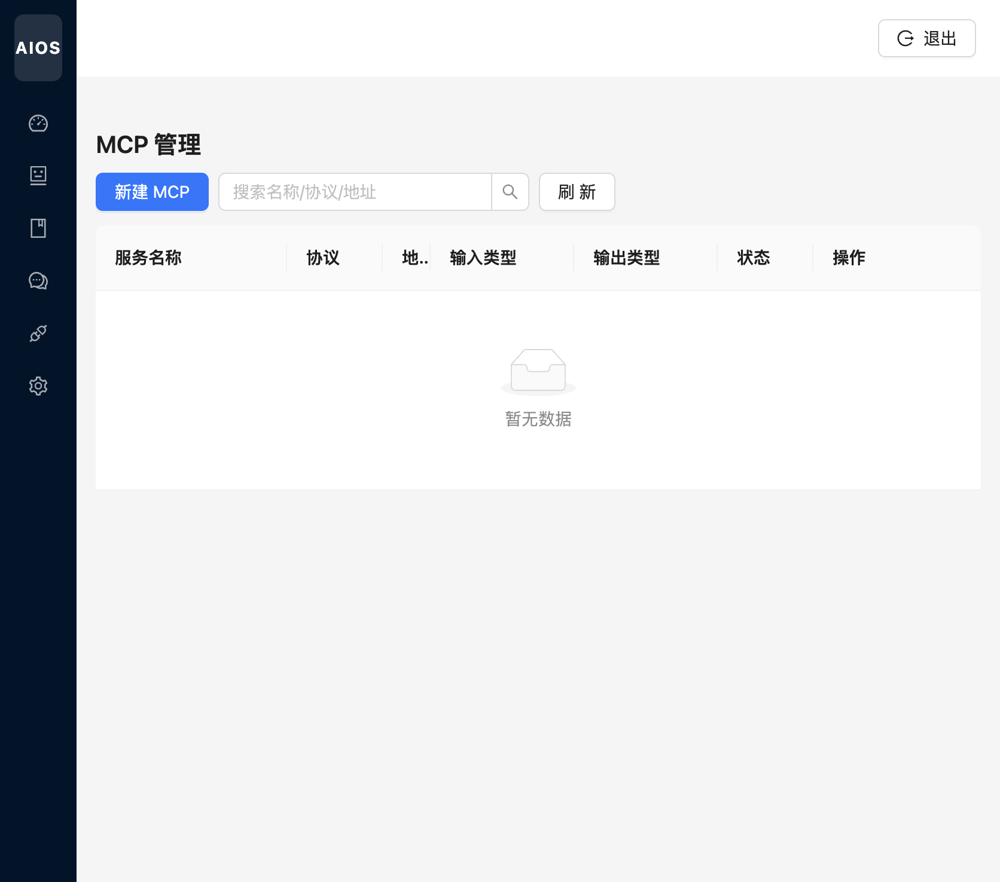
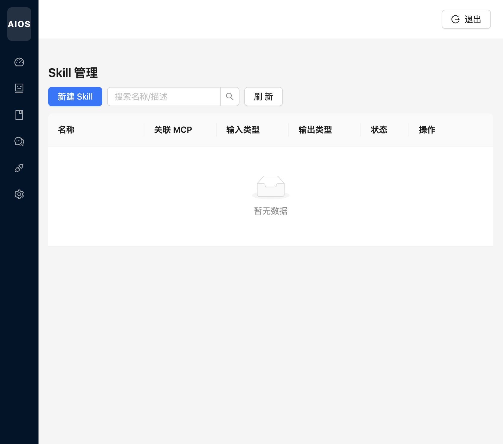
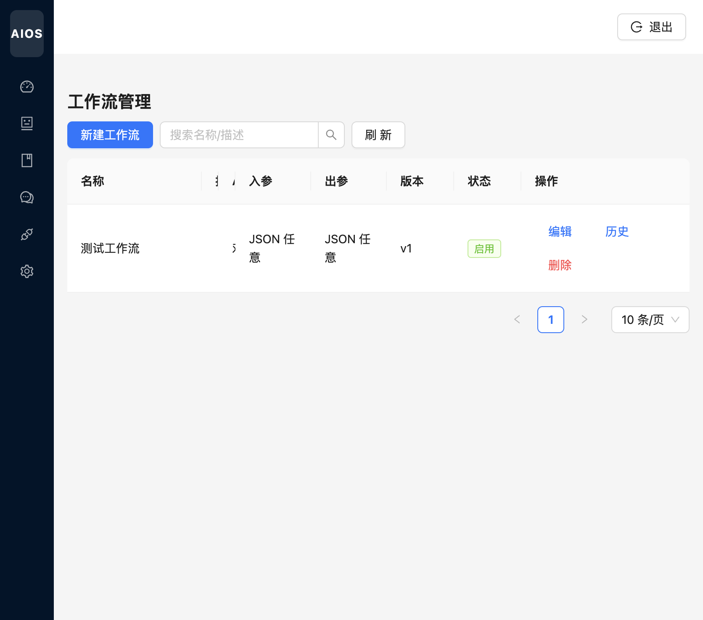
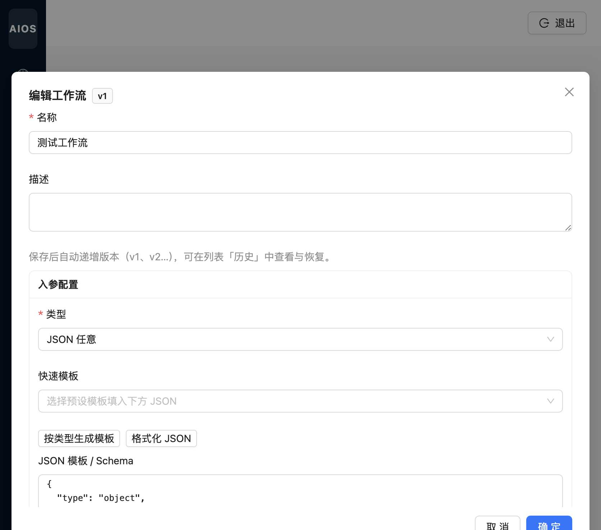

# AI 中心

[← 返回 Wiki 首页](Home.md)

AI 中心是平台核心配置区：先配置**模型**，再创建 **Agent** 并绑定模型、知识库、MCP、Skill，最后在**工作流**画布中编排多个 Agent 节点。

---

## 模型管理

路由：`/ai/models`

| 操作 | 说明 |
|------|------|
| 新建 | 填写模型名称、编码、供应商（OpenAI 兼容）、Base URL、API Key、温度等 |
| 编辑 | 修改已有模型；API Key 在列表中脱敏展示 |
| 启用 | 关闭后 Agent 不可再选用该模型 |

典型配置：供应商 `openai`，Base URL 指向兼容 `/v1/chat/completions` 的网关。

---

## Agent 管理

路由：`/ai/agents`

| 字段 | 说明 |
|------|------|
| 绑定模型 | 对话使用的 LLM |
| 思考模式 | 如 ReAct |
| 记忆 / 工具模式 | 会话记忆、工具自动选择等 |
| 知识库 / MCP / Skill | 多选关联，运行时注入上下文 |
| 系统 Prompt | Agent 角色与行为约束 |

支持按名称/描述搜索；**新建** 打开抽屉表单。

---

## MCP 管理

路由：`/ai/mcp-servers`

配置 Model Context Protocol 服务端：协议类型、地址、认证 JSON、输入/输出 Schema。当前运行时为 Prompt 注入占位，完整 JSON-RPC 见技术说明文档。

---

## Skill 管理

路由：`/ai/skills`

Skill 将 MCP 或工作流封装为可复用能力，供 Agent 在工具选择模式下调用。可配置 JSON Schema、Prompt 模板 ID 等。

---

## 工作流管理

路由：`/ai/workflows`

### 列表

| 列 | 说明 |
|----|------|
| 入参 / 出参 | JSON Schema 类型（如「JSON 任意」） |
| 版本 | 当前生效版本号 `vN` |
| 历史 | 查看历史版本并恢复 |
| 编辑 | 打开编排弹窗 |

**保存后版本自动递增**（v1、v2…），可在「历史」中对比与回滚。

### 编辑弹窗

1. **基本信息**：名称、描述、启用开关  
2. **入参 / 出参配置**：类型、快速模板、JSON Schema 编辑器  
3. **Agent 画布**（弹窗下方，需向下滚动）：React Flow 拖拽节点、连线；支持缩放与「添加 Agent」  
4. **确定**：持久化 DSL 并生成新版本  

运行时按 DAG **分层并行** 执行各 Agent 节点，详见说明文档「工作流运行时」章节。
