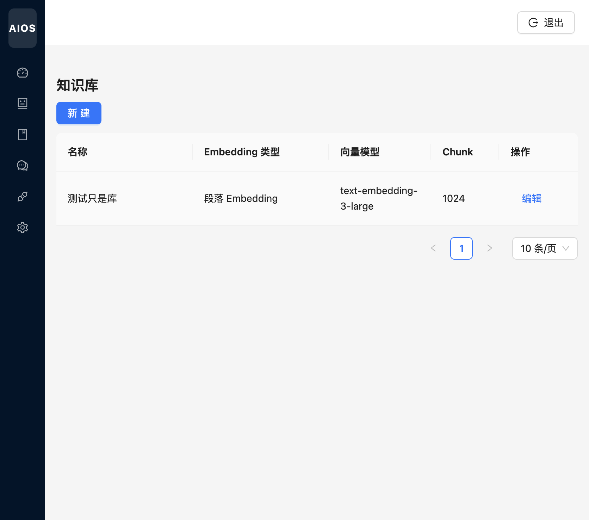
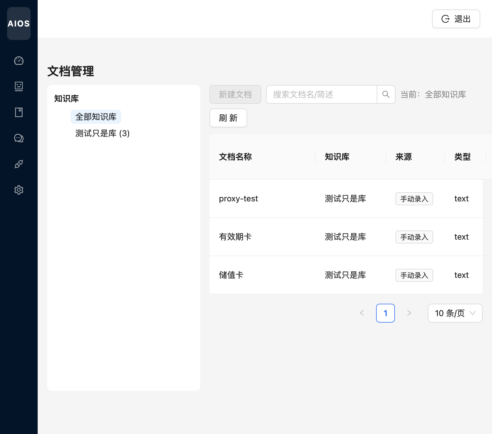

# 知识库

[← 返回 Wiki 首页](Home.md)

知识库为 Agent 提供 RAG 检索能力：业务数据存 MySQL，向量存 PostgreSQL pgvector。

---

## 知识库配置

路由：`/kb/bases`

| 字段 | 说明 |
|------|------|
| Embedding 类型 | 如段落 Embedding |
| 向量模型 | 可选，对接 Embeddings API |
| Chunk 大小 / 重叠 | 分块策略，影响检索粒度 |

**新建** 创建库后，在「文档管理」中向该库添加文档。

---

## 文档管理

路由：`/kb/documents`

### 左栏：知识库筛选

- **全部知识库**：跨库查看文档  
- 单击某一库：仅显示该库文档，并启用「新建文档」

### 右栏：文档列表

| 列 | 说明 |
|----|------|
| 文档名称 | 展示名 |
| 知识库 | 所属库 |
| 来源 | 手动录入 / 文件上传 / URL 下载 |

**新建文档** 支持三种录入方式：

1. **手动录入**：直接粘贴正文  
2. **文件上传**：上传 txt/md/pdf 等（按后端支持）  
3. **URL 下载**：从 URL 拉取内容  

保存后后台异步分块、向量化；Agent 绑定该知识库后，对话时可检索相关片段注入 Prompt。
