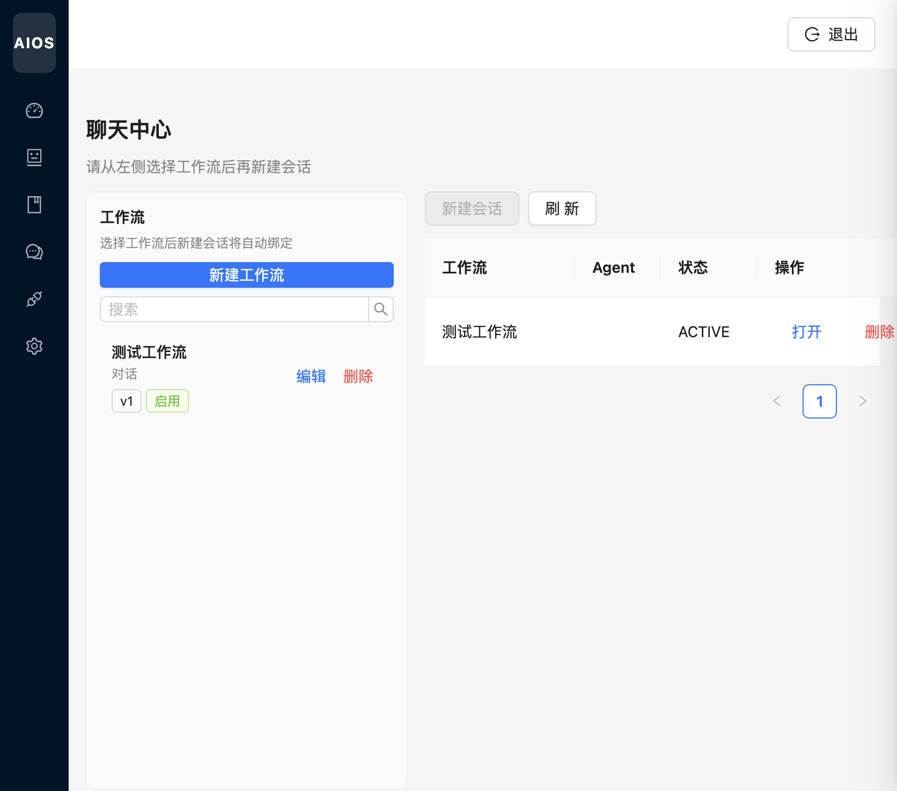
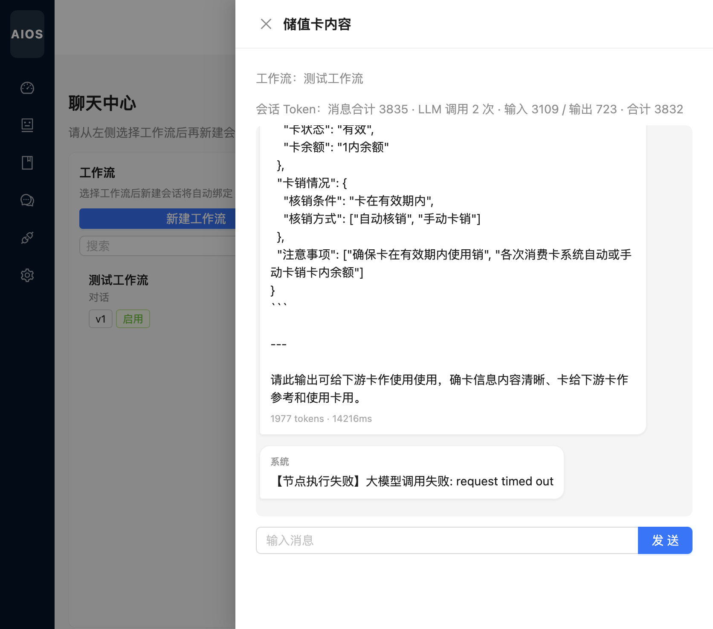

# 聊天中心

[← 返回 Wiki 首页](Home.md)

聊天中心将**工作流**与**会话**绑定：用户选择工作流后创建会话，发送消息即触发 DAG 运行时，按图依次调用各 Agent 与大模型。

---

## 主界面

路由：`/chat/sessions`

### 左侧：工作流

| 操作 | 说明 |
|------|------|
| 新建工作流 | 跳转工作流管理逻辑（弹窗/页内创建） |
| 搜索 | 过滤工作流名称 |
| 编辑 / 删除 | 维护工作流；需先选中工作流才能 **新建会话** |

### 右侧：会话列表

| 列 | 说明 |
|----|------|
| 工作流 | 会话绑定的工作流名称 |
| Agent | 当前节点或主 Agent（视数据而定） |
| 状态 | 如 ACTIVE |
| 打开 | 进入对话抽屉 |
| 删除 | 删除会话及历史消息 |

提示文案：**请从左侧选择工作流后再新建会话**。

---

## 会话抽屉（对话）

### 布局（气泡）

| 位置 | 角色 |
|------|------|
| **左侧** | 系统消息、助手（Assistant）回复 |
| **右侧** | 当前用户、访客消息 |

### 头部信息

- 会话标题、绑定工作流名称  
- **Token 统计**（示例）：`会话 Token：消息合计 · LLM 调用次数 · 输入/输出 · 合计`  
- 单条消息底部可显示 `token数 · 耗时ms`

### 输入区

- 底部 **输入消息** 文本框 + **发送**  
- 发送后调用 `POST /api/chat/sessions/{id}/messages`，后端走 `WorkflowRuntimeService`

### 常见状态

- 正常回复：左侧灰色气泡，含模型输出（可为 JSON 等结构化内容）  
- 系统错误：如 `【节点执行失败】大模型调用失败: request timed out`，需检查模型 Base URL、网络与超时配置  

关闭抽屉点击右上角 **关闭**，列表仍保留该会话。
