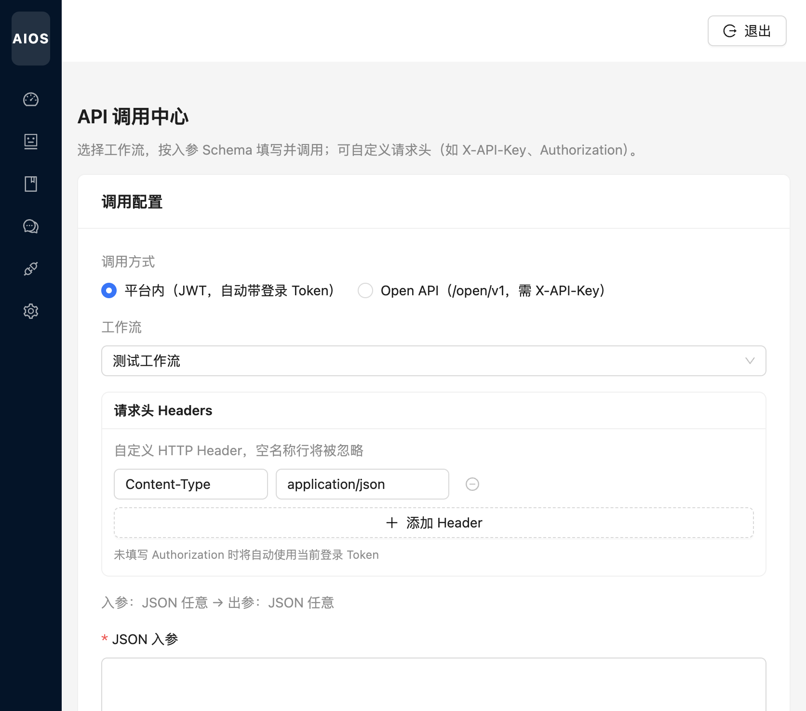

# API 调用中心

[← 返回 Wiki 首页](Home.md)

用于按工作流**入参/出参 Schema** 在线调试调用，无需手写 curl。支持平台内 JWT 与对外 Open API 两种模式。

路由：`/invoke/center`

---

## 调用配置

### 调用方式

| 模式 | 认证 | 接口前缀 |
|------|------|----------|
| **平台内（JWT）** | 自动携带登录 Token；未填 `Authorization` 时使用当前会话 | `/api/invoke/workflows/{id}` |
| **Open API** | 请求头 `X-API-Key`（演示 Key 见说明文档，生产勿用种子数据） | `/open/v1/workflows/{id}/invoke` |

### 工作流

下拉选择已启用工作流（如「测试工作流」）。选中后展示：

`入参: <类型> -> 出参: <类型>`

### 请求头 Headers

- 默认一行 `Content-Type: application/json`  
- **添加 Header**：可增 `X-API-Key`、`Authorization` 等  
- 平台内模式：未填 Authorization 时自动使用登录 JWT  

### JSON 入参

根据工作流入参 Schema 填写 JSON（必填）。点击 **执行调用** 后：

1. 后端校验入参 `WorkflowIoSupport`  
2. 执行 DAG，汇总各 Agent 输出  
3. 按出参 Schema 格式化返回，页面展示响应体  

---

## 与聊天中心的区别

| 维度 | 聊天中心 | API 调用中心 |
|------|----------|----------------|
| 交互 | 多轮对话、消息历史 | 单次请求/响应 |
| 入参 | 用户自然语言 | 结构化 JSON |
| 出参 | 聊天气泡 | API JSON 结果 |
| 鉴权 | 仅登录用户 | 可选 Open API Key |

集成方推荐使用 Open API；内部联调使用平台内 JWT 即可。
