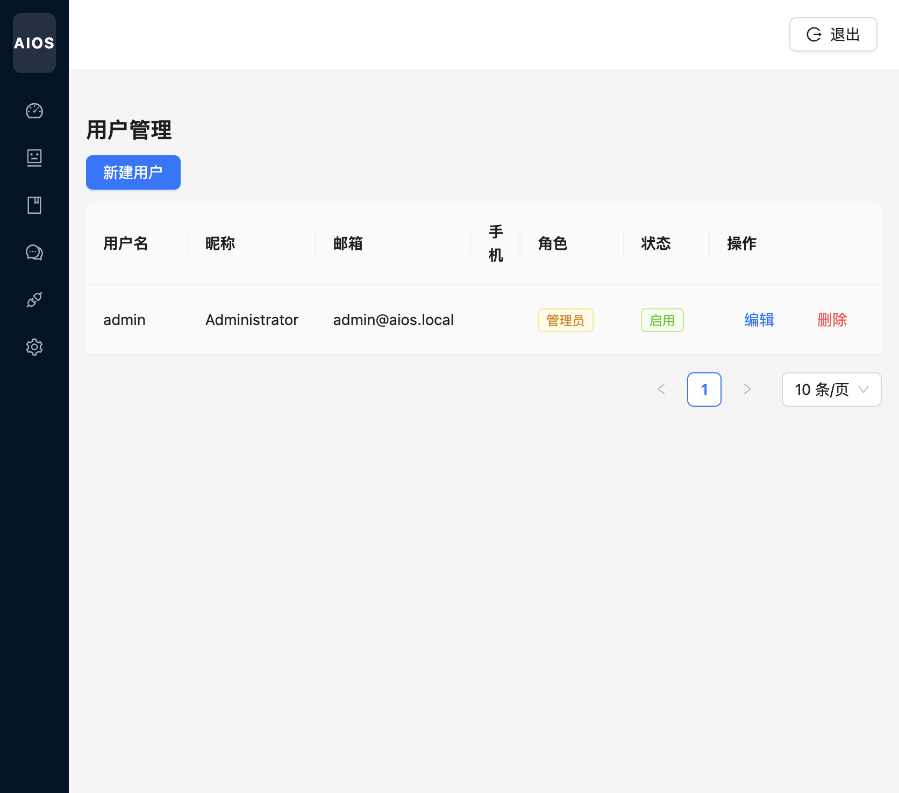
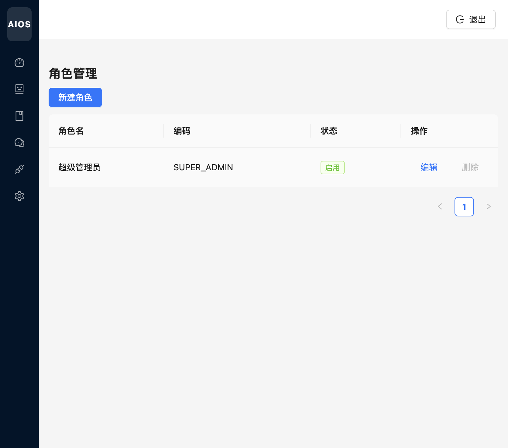
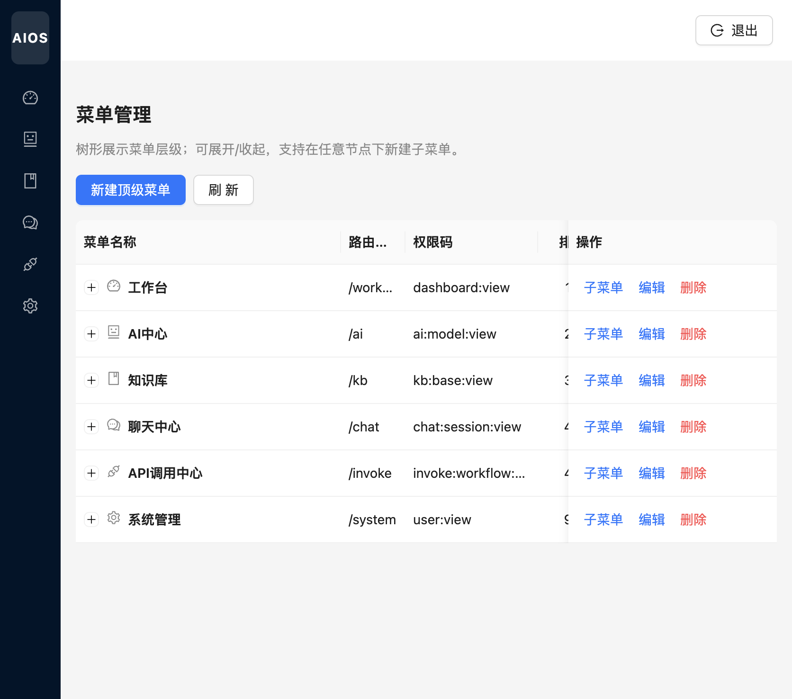

# 系统管理

[← 返回 Wiki 首页](Home.md)

系统管理提供 RBAC：**用户** 关联 **角色**，角色拥有 **权限**；**菜单** 树控制侧栏可见性与路由。

---

## 用户管理

路由：`/system/users`

| 操作 | 说明 |
|------|------|
| 新建用户 | 用户名、密码、昵称、邮箱、手机、角色、启用状态 |
| 编辑 | 修改资料；超级管理员不可随意删除 |
| 删除 | 移除账号（注意业务约束） |

列表展示角色标签（如「管理员」）与账号状态（启用/禁用）。

---

## 角色管理

路由：`/system/roles`

| 操作 | 说明 |
|------|------|
| 新建角色 | 角色名、编码、描述 |
| 编辑 | 修改基本信息 |
| 分配权限 | 勾选权限码（如 `ai:workflow:run`、`invoke:workflow:run`） |

内置 **超级管理员**（`SUPER_ADMIN`）拥有全部权限。

---

## 菜单管理

路由：`/system/menus`

树形展示平台菜单层级，与侧栏一一对应：

| 菜单 | 路由 | 权限码示例 |
|------|------|------------|
| 工作台 | `/dashboard` | `dashboard:view` |
| AI 中心 | `/ai` | `ai:model:view` |
| 知识库 | `/kb` | `kb:base:view` |
| 聊天中心 | `/chat` | `chat:session:view` |
| API 调用中心 | `/invoke` | `invoke:workflow:view` |
| 系统管理 | `/system` | `user:view` |

| 操作 | 说明 |
|------|------|
| 新建顶级菜单 | 增加一级模块 |
| 子菜单 | 在某节点下新增子项 |
| 编辑 | 名称、路由、图标、可见权限码、排序、显示/启用 |
| 删除 | 移除菜单（需无关键依赖） |

修改菜单后，用户重新登录或刷新权限缓存后生效（视后端实现）。

---

## 权限管理

路由：`/system/permissions`（界面与角色「分配权限」联动，无单独截图）

权限码格式：`模块:资源:动作`，例如 `invoke:workflow:run`。新增 API 或页面时需在种子数据或本页维护权限，并分配给角色。
