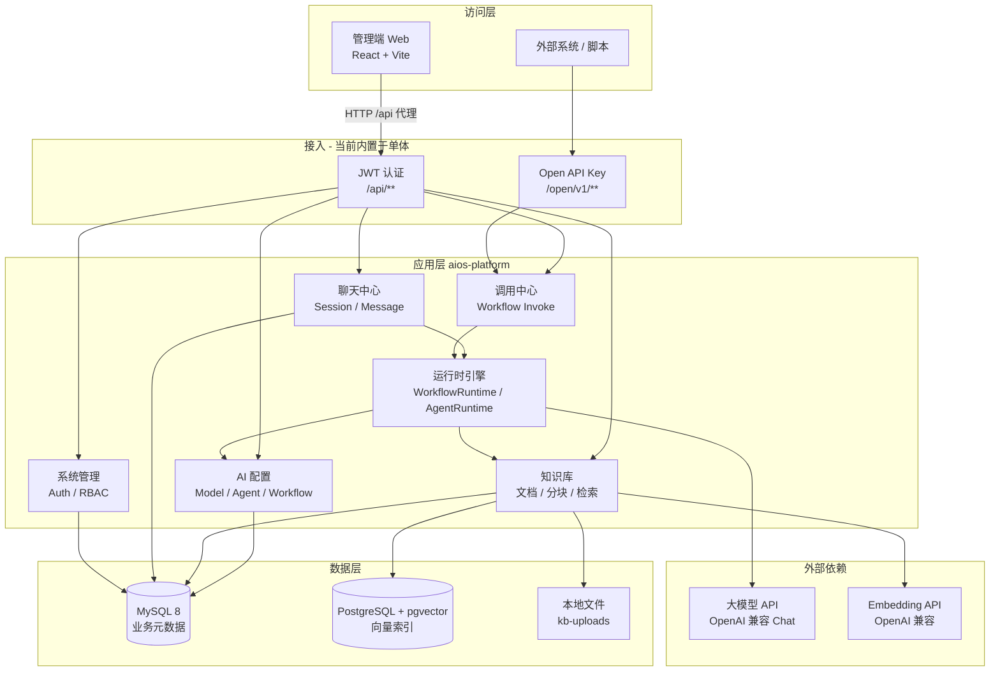
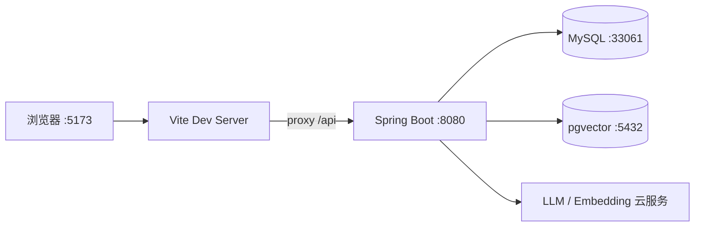
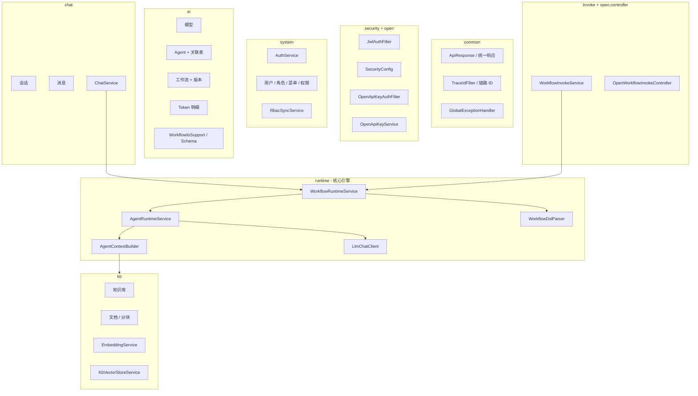
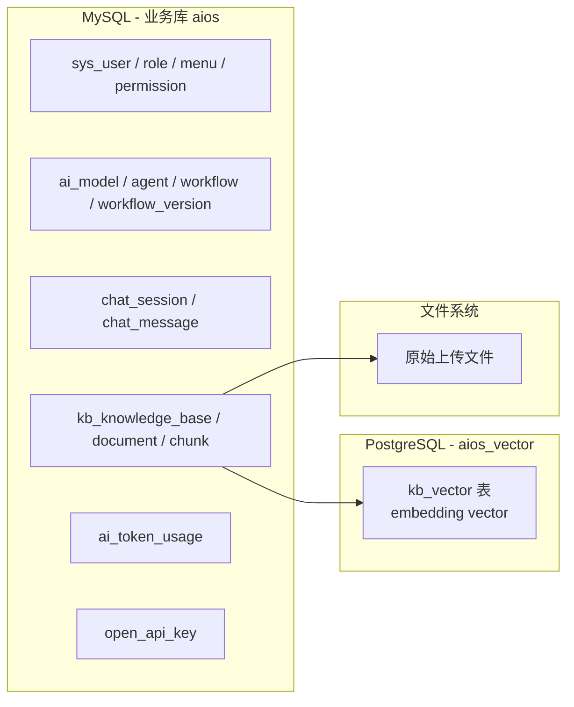
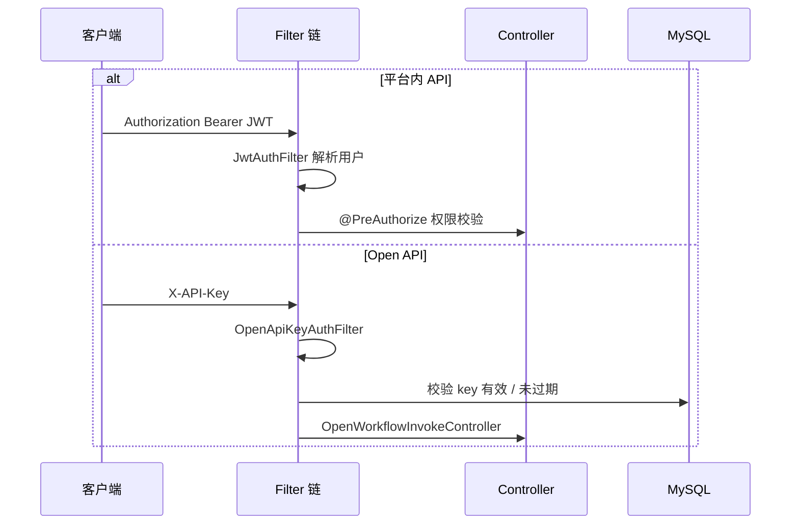
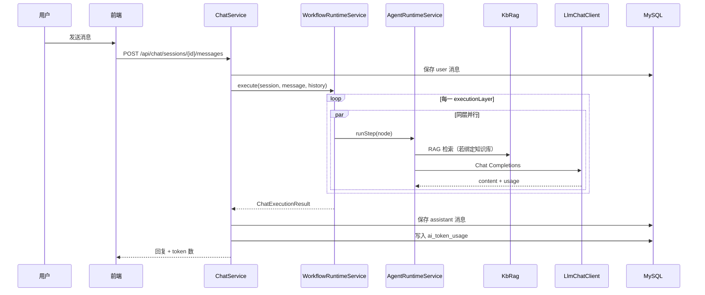
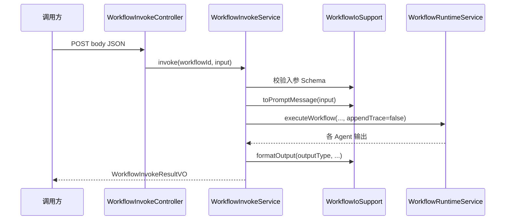
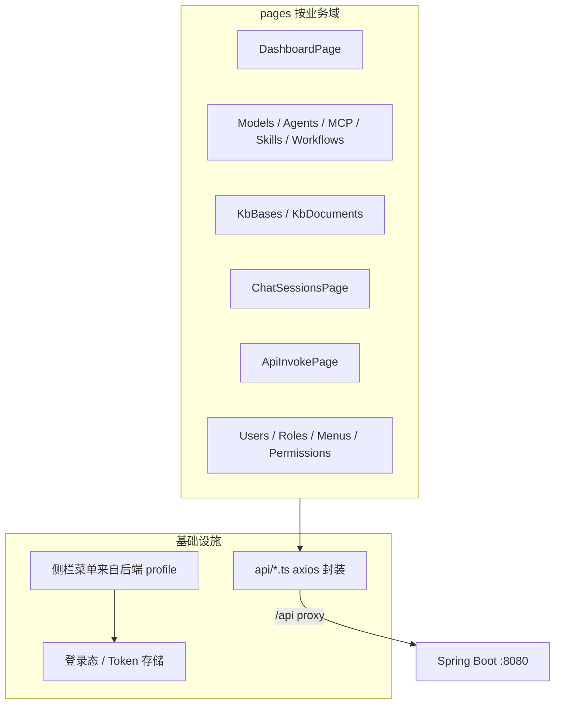

# AIOS 系统架构介绍

本文档描述 AIOS 企业级 AI Agent 管理平台的**逻辑架构、部署拓扑、模块划分与核心数据流**，供架构评审、新人 onboarding 与集成对接参考。

相关文档：

- [AIOS平台说明文档](AIOS平台说明文档.md) — 功能与 API 细节
- [Wiki 操作手册](wiki/Home.md) — 界面截图与操作说明

---

## 1. 架构定位

AIOS 当前为 **单体 Spring Boot + React 管理端** 的 MVP 实现，目标是在一套控制台内完成：

| 能力域 | 说明 |
|--------|------|
| 配置中心 | 模型、Agent、MCP/Skill、工作流画布、知识库 |
| 运行时 | 工作流 DAG 分层执行、多 Agent 链式调用、RAG、Token 统计 |
| 对外集成 | 平台内 JWT API + Open API（`X-API-Key`）按 Schema 调用工作流 |
| 治理 | RBAC（用户 / 角色 / 菜单 / 权限）、全链路 TraceId |

**尚未纳入本仓库**：API Gateway、Nacos、完整 MCP JSON-RPC、SSE 流式输出、多租户隔离等（见 PRD 后续阶段）。

---

## 2. 逻辑架构总览



**设计要点：**

- **配置与执行分离**：工作流 DSL、Agent 绑定关系存 MySQL；执行时由 `runtime` 包只读加载并驱动 LLM。
- **双库模型**：关系型数据与权限在 MySQL；语义检索在 pgvector，通过 `KbVectorStoreService` 访问。
- **统一运行时**：聊天与 API 调用均走 `WorkflowRuntimeService.executeWorkflow`，保证行为一致。

---

## 3. 部署架构

### 3.1 推荐开发 / 单机部署



| 组件 | 默认地址 | 说明 |
|------|----------|------|
| 前端 | `http://127.0.0.1:5173` | `npm run dev`，`/api` 代理至后端 |
| 后端 | `http://127.0.0.1:8080` | `mvn spring-boot:run` |
| MySQL | `127.0.0.1:33061` | 库 `aios`，`docker-compose` 或本机 |
| pgvector | `127.0.0.1:5432` | 库 `aios_vector` |
| 文件存储 | `./data/kb-uploads` | 知识库上传目录（可配置） |

一键数据库：`./scripts/db-init-all.sh` → `docker/docker-compose.yml`。

### 3.2 生产演进方向（规划）

当前为**单进程单体**；生产可演进为：

1. 前端静态资源 + CDN / Nginx
2. 后端多实例 + 负载均衡（会话无状态，JWT）
3. MySQL 主从 / 托管 RDS；pgvector 独立实例或托管向量库
4. 对象存储（S3/OSS）替代本地 `kb-uploads`
5. 可选 API Gateway 统一 `/api` 与 `/open`，限流、审计、WAF

---

## 4. 后端模块架构

后端包路径：`com.aios.platform`，按**领域分包**（非微服务拆分）。



| 包 | 职责 |
|----|------|
| `bootstrap` | 首次启动种子数据（admin、菜单、权限） |
| `security` | JWT 无状态认证、`@PreAuthorize` 方法级权限 |
| `open` | Open API Key 校验、对外 `/open/v1` 工作流调用 |
| `system` | 登录注册、RBAC CRUD、配置项 |
| `ai` | 模型 / Agent / MCP / Skill / 工作流及版本、Token 落库 |
| `kb` | 知识库 CRUD、文档索引、RAG 检索、pgvector 双数据源配置 |
| `chat` | 会话消息、绑定 `workflowId`、Token 统计 API |
| `invoke` | 入参校验、Prompt 组装、出参格式化 |
| `runtime` | **DAG 执行引擎**，不直接暴露 REST |
| `dashboard` | 仪表盘聚合统计 |
| `common` | 统一响应体、TraceId、业务异常 |

持久化：**MyBatis Plus**，逻辑删除字段 `deleted`。

---

## 5. 数据架构

### 5.1 存储分工



| 存储 | 典型实体 | 用途 |
|------|----------|------|
| MySQL | `ai_workflow.dsl_json` | 画布节点、边、`executionLayers` |
| MySQL | `ai_workflow_version` | 每次保存的版本快照 |
| MySQL | `chat_session.workflow_id` | 会话绑定工作流 |
| MySQL | `ai_token_usage` | 每次 LLM 调用的 token 明细 |
| MySQL | `kb_chunk` | 文本分块元数据 |
| pgvector | 向量行 | 与 chunk 关联的 embedding，相似度检索 |
| 本地目录 | 上传文件 | `aios.storage.kb-upload-dir` |

### 5.2 工作流 DSL 与执行计划

保存工作流时，`WorkflowGraphSupport` / `WorkflowDslSupport` 将 React Flow 图转为 JSON DSL，核心字段：

- `nodes`：Agent 节点（含 `agentId`、节点 key）
- `edges`：有向边
- `executionLayers`：拓扑分层结果，**同层节点并行执行**

运行时 `WorkflowDslParser` 解析为 `WorkflowExecutionPlan`，`WorkflowRuntimeService` 按层 `CompletableFuture` 并行调用 `AgentRuntimeService.runStep`。

---

## 6. 安全架构



| 路径前缀 | 认证方式 | 说明 |
|----------|----------|------|
| `/api/auth/login` 等 | 无 | 登录、注册、刷新 Token |
| `/api/**` | JWT | 除 auth、swagger 外需认证 |
| `/open/**` | `X-API-Key` | Filter 内校验，不走 JWT |
| Swagger | 可选 Bearer | 调试管理端 API |

- 密码：**BCrypt** 存储
- 会话：**无状态**（`STATELESS`），不依赖服务端 Session
- 权限码：`模块:资源:动作`，如 `invoke:workflow:run`、`ai:workflow:update`
- 前端：按 `/api/auth/profile` 返回的菜单与权限动态渲染路由

---

## 7. 核心运行时数据流

### 7.1 聊天中心



### 7.2 API 调用中心



平台内路径：`/api/invoke/workflows/{id}`；对外开放：`/open/v1/workflows/{id}/invoke`。

### 7.3 知识库 RAG（索引与检索）

**索引（写路径）：** 文档保存 → 分块 `TextChunkSplitter` → `EmbeddingService` 调外部 API → 向量写入 pgvector + `kb_vector_ref` 元数据。

**检索（读路径）：** `AgentContextBuilder` 在 Agent 执行前按绑定知识库 ID 查询 → `KbVectorStoreService` 相似度 Top-K → 拼入系统 Prompt。

未配置 `OPENAI_API_KEY` 时可能降级为零向量（仅调试，生产必须配置真实 Embedding）。

---

## 8. 前端架构

| 技术 | 用途 |
|------|------|
| React 18 + TypeScript | 组件化 UI |
| Vite | 构建与 dev server |
| Ant Design | 表格、表单、布局 |
| React Router | 路由，`App.tsx` 声明页面 |
| React Flow | 工作流画布编排 |



- **权限**：路由与按钮与后端 `permission` 码对齐
- **聊天 UI**：抽屉 + 气泡布局（用户右、助手/系统左）
- **调用中心**：`InvokeHeadersEditor`、`WorkflowInvokeInput` 支持 JWT / Open 双模式

---

## 9. 外部集成接口

| 类型 | 方法 | 路径 | 认证 |
|------|------|------|------|
| 登录 | POST | `/api/auth/login` | 无 |
| 工作流调用（内） | POST | `/api/invoke/workflows/{id}` | JWT + `invoke:workflow:run` |
| 工作流调用（外） | POST | `/open/v1/workflows/{id}/invoke` | `X-API-Key` |
| 工作流 IO 元数据 | GET | `/api/invoke/workflows/{id}/io` | JWT |
| 聊天发消息 | POST | `/api/chat/sessions/{id}/messages` | JWT |
| Token 统计 | GET | `/api/chat/sessions/{id}/token-stats` | JWT |
| RAG 检索 | POST | `/api/kb/rag/search` | JWT |

大模型调用约定：**OpenAI 兼容** `POST {baseUrl}/chat/completions`，请求/响应解析 `usage` 字段用于 Token 统计。

---

## 10. 可观测性与运维

| 机制 | 实现 |
|------|------|
| 链路追踪 | `TraceIdFilter` 生成/透传 `X-Trace-Id`，`ApiResponse` 带回 |
| API 文档 | SpringDoc `/swagger-ui.html` |
| 日志 | MyBatis SQL 日志（开发）、业务异常统一 `BusinessException` |
| 配置 | `application.yml` + 环境变量（如 `OPENAI_API_KEY`） |

---

## 11. 架构约束与演进建议

### 当前约束

1. **单体进程**：运行时、索引、API 同 JVM，水平扩展需关注文件上传与异步索引任务。
2. **MCP**：元数据 + Prompt 描述注入，非标准 MCP Server 进程通信。
3. **同步调用**：聊天与 Invoke 均为阻塞 HTTP，长耗时模型易触发超时（`aios.llm.timeout-seconds`）。
4. **密钥**：模型 API Key、JWT secret、演示 Open API Key 需生产轮换（见安全审计说明）。

### 建议演进顺序

1. 流式 SSE/WebSocket 聊天与 Invoke 进度回调  
2. MCP 客户端真实 tools/list、tools/call  
3. 工作流执行异步化 + 任务队列（Redis/RabbitMQ）  
4. Gateway + 集中鉴权、限流、审计日志  
5. 多租户（`tenant_id` 贯穿表结构与 Filter）

---

## 12. 仓库目录与架构映射

```
aios-project/
├── frontend/          → 访问层（管理端 SPA）
├── backend/           → 应用层 + 运行时引擎
│   └── .../runtime/   → 核心执行（宜保持无 Web 依赖）
├── sql/               → MySQL / pgvector  schema 与迁移
├── docker/            → 数据层容器编排
├── docs/              → 说明文档、Wiki、本文档
└── scripts/           → 数据库初始化脚本
```

---

*文档版本与代码同步：工作流 DAG 运行时、双 API 调用通道、Token 统计、工作流版本历史均已纳入上述架构描述。*
